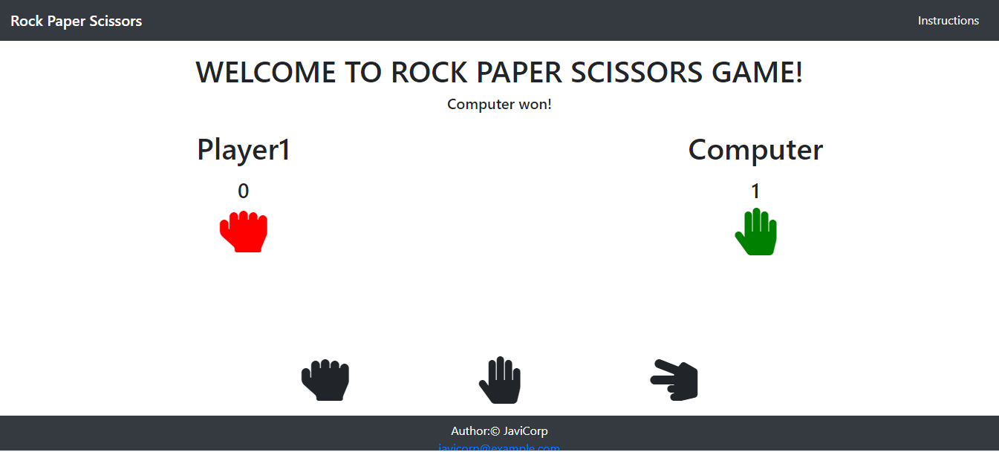
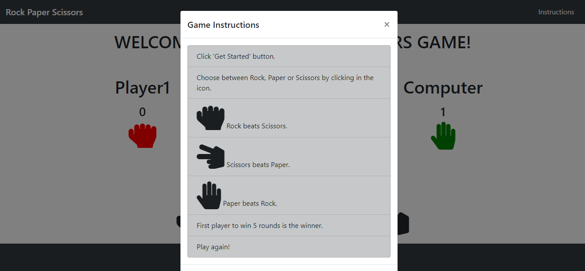

<!--
*** Thanks for checking out this README Template. If you have a suggestion that would
*** make this better, please fork the repo and create a pull request or simply open
*** an issue with the tag "enhancement".
*** Thanks again! Now go create something AMAZING! :D
-->

<!-- PROJECT SHIELDS -->
<!--
*** I'm using markdown "reference style" links for readability.
*** Reference links are enclosed in brackets [ ] instead of parentheses ( ).
*** See the bottom of this document for the declaration of the reference variables
*** for contributors-url, forks-url, etc. This is an optional, concise syntax you may use.
-->

# ROCK PAPER SCISSORS

> Classic game ROCK, PAPER, SCISSORS to play in the browser. Built with JavaScript.

Game:

Instructions:


Additional description about the project and its features.

## Built With

- HTML
- CSS
- BOOTSTRAP
- JAVASCRIPT

## Instrucions to Play

- Click 'Get Started' button.
- Choose between Rock, Paper or Scissors by clicking in the icon.
- Rock beats Scissors.
- Scissors beats Paper.
- Paper beats Rock.
- First player to win 5 rounds is the winner.
- Play again!

### Run tests

- Run ```npm test``` on the root directory to run all the tests.
- Run ```npm test testfile.test.js ``` on root directory to run test for a single file.

## Future features

- Add animations.

## 🤝 Contributing

Contributions, issues and feature requests are welcome!


## Show your support

Give a ⭐️ if you like this project!